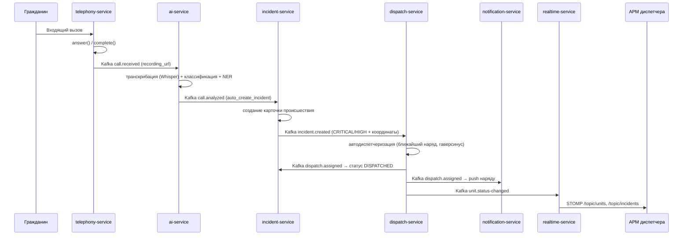

# Архитектура системы 112/МЧС

## Обзор

Система диспетчеризации экстренных служб Республики Беларусь построена как набор
самостоятельных микросервисов, взаимодействующих через синхронный REST (команды/запросы
от клиентов) и асинхронную шину событий Apache Kafka (междоменная интеграция). Каждый
сервис владеет собственной схемой данных (database-per-service) и не обращается к чужим
таблицам напрямую — только через API или события.

### Принципы

- **Domain-Driven Design.** Каждый сервис = ограниченный контекст (bounded context) с
  собственной моделью: происшествие, наряд, вызов, станция и т. д.
- **Гексагональная архитектура (порты/адаптеры).** Доменное ядро не зависит от
  инфраструктуры; внешние интеграции (Kafka, SMTP, SMS-шлюз) подключаются через адаптеры.
  Наиболее явно применено в `notification-service` (порт `ChannelSender` + 3 адаптера).
- **CQRS.** В ядре — `incident-service` — команды (мутации) и запросы (чтение с Redis-кэшем)
  разделены: `IncidentCommandService` и `IncidentQueryService`.
- **Event-driven.** Значимые изменения публикуются в Kafka; заинтересованные сервисы
  реагируют независимо, обеспечивая слабую связанность.
- **Zero-trust периметр.** Единственная точка входа — `gateway-service`; все запросы
  проходят проверку JWT (Keycloak OIDC) и RBAC.

## Карта сервисов

| Сервис               | Контекст / ответственность                                        | Хранилище            |
|----------------------|-------------------------------------------------------------------|----------------------|
| gateway-service      | Единая точка входа, маршрутизация, JWT, CORS, rate limiting        | — (stateless)        |
| auth-service         | Управление пользователями и ролями поверх Keycloak Admin API       | auth_db + Keycloak   |
| incident-service     | Ядро домена: карточки происшествий, статусная модель, история (CQRS)| incident_db + Redis  |
| dispatch-service     | Наряды и подразделения, автодиспетчеризация по геолокации          | dispatch_db          |
| telephony-service    | Жизненный цикл вызовов, запись, передача на транскрибацию          | telephony_db         |
| gis-service          | Геокодирование, ближайшие станции (PostGIS KNN), зоны ответственности| gis_db (PostGIS)    |
| audit-service        | Централизованный журнал аудита (JSONB), полнотекстовый поиск       | audit_db             |
| notification-service | Уведомления по каналам Email/SMS/Push (гексагон)                   | notification_db      |
| realtime-service     | Мост Kafka → WebSocket/STOMP для веб-клиентов                      | — (stateless)        |
| ai-service           | Классификация, NER, извлечение адреса/пострадавших, Whisper        | — (Python/FastAPI)   |
| frontend-dispatcher  | АРМ диспетчера (React 19)                                          | — (SPA)              |

## Потоки событий (Kafka)

Топики и их продюсеры/консьюмеры:

| Топик                   | Публикует            | Потребляют                                   |
|-------------------------|----------------------|----------------------------------------------|
| `incident.created`      | incident-service     | dispatch-service, realtime-service           |
| `incident.updated`      | incident-service     | realtime-service                             |
| `dispatch.assigned`     | dispatch-service     | incident-service, notification-service, realtime-service |
| `unit.status-changed`   | dispatch-service     | realtime-service                             |
| `call.received`         | telephony-service    | ai-service                                   |
| `call.analyzed`         | ai-service           | telephony-service, incident-service, realtime-service |
| `notification.requested`| (любой сервис)       | notification-service                         |
| `audit.events`          | все сервисы          | audit-service                                |

### Сценарий «звонок → происшествие → наряд»



## Статусные модели

### Происшествие (`IncidentStatus`)

```
RECEIVED → CLASSIFIED → DISPATCHED → IN_PROGRESS → RESOLVED → CLOSED
                                          ↘ CANCELLED
```

Переходы валидируются картой допустимых переходов в enum; недопустимый переход
приводит к `IllegalStatusTransitionException` (HTTP 409). Конкурентные правки двух
диспетчеров отсекаются оптимистической блокировкой (`@Version` → HTTP 409).

### Наряд/подразделение (`UnitStatus`)

```
AVAILABLE → DISPATCHED → EN_ROUTE → ON_SCENE → RETURNING → AVAILABLE
                                                    ↘ OUT_OF_SERVICE
```

### Вызов (`CallStatus`)

```
RINGING → ACTIVE → ON_HOLD → COMPLETED → TRANSCRIBED → ANALYZED
```

## Автодиспетчеризация

`dispatch-service` подписан на `incident.created`. Для приоритетов CRITICAL/HIGH при
наличии координат выбирается ближайшее доступное подразделение требуемого типа. Дистанция
считается по формуле гаверсинуса (`GeoDistance.haversineKm`); в `gis-service` для запросов
«ближайшая станция» используется PostGIS-оператор KNN (`<->`) и `ST_Distance`.

## Безопасность

- **OAuth2/OIDC** через Keycloak (realm `emergency-112`). Frontend использует
  Authorization Code + PKCE (S256).
- **RBAC-роли:** `ROLE_DISPATCHER`, `ROLE_SENIOR_DISPATCHER`, `ROLE_ADMIN`, `ROLE_CREW`, `ROLE_ANALYST`.
  Роли извлекаются из claim `realm_access.roles` JWT и маппятся в Spring authorities.
- **Gateway** выполняет валидацию токена (issuer Keycloak), CORS и rate limiting
  (Redis, 20 req/s, burst 40) на пользователя/IP.

## Наблюдаемость

- **Метрики:** каждый Java-сервис отдаёт `/actuator/prometheus` (Micrometer);
  ai-service — совместимый endpoint. Сбор — Prometheus.
- **Логи:** Promtail → Loki; просмотр в Grafana.
- **Дашборды/алерты:** Grafana поверх Prometheus + Loki.
- **Аудит:** бизнес-события (кто, что, над чем) агрегируются в `audit-service` (JSONB + GIN).

## Хранение данных

- PostgreSQL с расширением **PostGIS** (геоданные `gis-service`, координаты).
- Схема каждого сервиса версионируется **Liquibase** (`db.changelog-master.yaml`),
  `ddl-auto: validate` — приложение не меняет схему в рантайме.
- **Redis** — кэш статистики происшествий (TTL 15 с) и backend rate limiting шлюза.
- Гетерогенные события аудита хранятся как **JSONB** с GIN-индексом.
