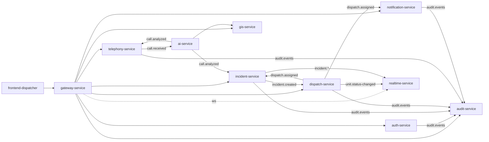

# System Structure — ЕАСУР

> Приоритет SSOT: часть Architecture Baseline. Статус: APPROVED · Baseline: v1.0
>
> Документ описывает логические модули, будущие сервисы, общие библиотеки и зависимости.
> Код не реализуется в рамках данного документа.

## 1. Логические модули (bounded contexts)

| Модуль | Тип | Порт | Хранилище | Синхронные зависимости | События (publish / consume) |
|--------|-----|------|-----------|------------------------|-----------------------------|
| gateway-service | периметр | 8080 | — | все прикладные (маршрутизация) | — |
| auth-service | домен | 8081 | auth_db + Keycloak | Keycloak Admin API | publish: audit.events |
| incident-service | ядро (CQRS) | 8082 | incident_db + Redis | — | publish: incident.created, incident.updated, audit.events · consume: dispatch.assigned, call.analyzed |
| dispatch-service | домен | 8083 | dispatch_db | — | publish: dispatch.assigned, unit.status-changed, audit.events · consume: incident.created |
| telephony-service | домен | 8084 | telephony_db | ai-service (косвенно через Kafka) | publish: call.received, audit.events · consume: call.analyzed |
| gis-service | домен | 8085 | gis_db (PostGIS) | — | — |
| audit-service | домен | 8086 | audit_db | — | consume: audit.events |
| notification-service | домен (гексагон) | 8087 | notification_db | SMTP, SMS-шлюз | consume: notification.requested, dispatch.assigned |
| realtime-service | интеграция | 8088 | — | — | consume: incident.*, dispatch.assigned, unit.status-changed, call.analyzed |
| ai-service | приложение | 8090 | — | gis-service (геокодирование) | publish: call.analyzed · consume: call.received |
| frontend-dispatcher | клиент | 80 | — | gateway | — |

## 2. Карта зависимостей (синхронные + событийные)



Правило: стрелки событий идут через Kafka (слабая связанность). Единственная синхронная
зависимость между прикладными сервисами — `ai-service → gis-service` (геокодирование);
кандидат на перевод в асинхронный режим при появлении требований по латентности (Backlog).

## 3. Будущие сервисы (вне текущей Baseline)

Заведение — только через RFC + ADR (новый bounded context):
- **mobile-crew** — приложение экипажа (получение назначений, статусы на месте).
- **mobile-citizen** — обращения граждан (текст/гео/медиа).
- **integration-gateway** — интеграции с внешними ведомственными системами.
- **analytics-service** — витрины и отчётность (отделить чтение от оперативного ядра).
- **reporting-service** — регламентные отчёты.

## 4. Общие библиотеки

Политика: **минимизировать общий код между сервисами** (автономность bounded contexts выше
DRY между ними). Допустимо разделять только стабильные, не-доменные кросс-срезы, и только
по ADR:
- контрактные схемы событий/DTO публикуются как версионируемые артефакты (не как «общий домен»);
- общие эксплуатационные шаблоны — на уровне Helm (`helm/emergency-112/templates`), а не кода.

Запрещено: общая доменная модель, общий слой доступа к данным, «utils»-библиотека с бизнес-логикой.

## 5. Структура репозитория (Baseline, изменяется только через ADR)

```
/
├─ services/            # Java-микросервисы (по одному каталогу на сервис)
├─ ai-service/          # Python/FastAPI
├─ frontend/dispatcher/ # React SPA
├─ helm/emergency-112/  # зонтичный Helm-чарт
├─ infrastructure/      # init БД, Keycloak realm, мониторинг, backup
├─ docs/                # архитектура и управление (SSOT)
│  ├─ architecture/ adr/ rfc/ governance/ standards/ risk/
│  ├─ business/ deployment/ database/ api/ security/ testing/
│  ├─ Vision.md  Architecture.md  architecture.md  operations.md
├─ docker-compose.yml
└─ .gitlab-ci.yml
```

## 6. Правила зависимостей модулей (сводка)

1. database-per-service; чужие БД недоступны.
2. Синхронно — только через REST-контракт (OpenAPI, версия в пути).
3. Предпочтение — событиям Kafka; циклы между сервисами запрещены.
4. Клиент → только Gateway.
5. Новый обмен/сервис/технология — через ADR/RFC (Architecture Freeze).
